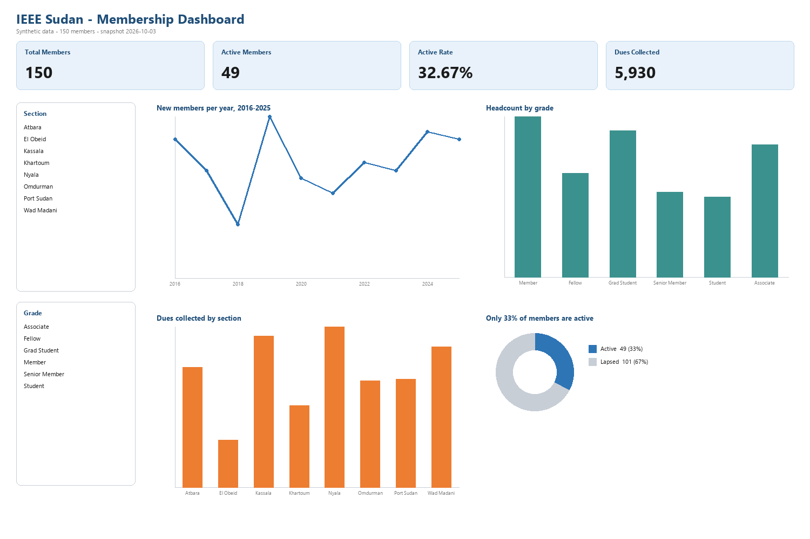

# IEEE Sudan — Membership Roster Dashboard

An interactive Excel dashboard summarising membership growth, composition, dues revenue and engagement for a hypothetical IEEE Sudan Subsection.

> **Data is synthetic.** No real IEEE members are represented. Generated for portfolio demonstration only.

## Problem

Which member segments drive growth and dues revenue, and where is engagement slipping?

## Data

150 member records with 12 fields: Member ID, first/last name, grade, section, join date, dues status, dues amount, events attended, last activity, derived membership status, and email.

Data was generated in Excel using `INDEX`, `RANDBETWEEN` and `DATE` driven by lookup lists, then **frozen to static values** with Paste Special → Values so the figures are stable. Email addresses use the reserved `example.org` domain.

All "Active" figures are measured against the snapshot date **2026-10-03**.

## Method

- Data stored as a named Excel Table (`Members`) so ranges auto-expand
- `Grade` and `Section` constrained with Data Validation lists
- Derived columns: `Dues Amount` (VLOOKUP by grade), `Membership Status` (activity within 365 days)
- Summary sheet: `COUNTIF`, `COUNTIFS`, `SUMIFS`, `AVERAGEIF`, `SUMPRODUCT`
- Four PivotTables with PivotCharts, filtered by two slicers (Section, Grade) connected to all four pivots
- Dashboard with four KPI cards and four charts

## Result

| KPI | Value |
|---|---|
| Total members | 150 |
| Active members | 49 (33%) |
| Dues collected | 5,930 |
| Assessed dues | 6,865 |
| Average events per member | 6.37 |

## Insight

- Only **33% of members are active** as of the snapshot date.
- Students and Grad Students are 48 of 150 members (**32%**) but contribute only 690 of 5,930 collected dues (**12%**).
- **14% of assessed dues are uncollected** (5,930 of 6,865).

## What I'd do next

Connect a real membership export, add year-over-year retention, and track engagement by section to target re-engagement campaigns.

## Definitions

| Term | Meaning |
|---|---|
| Active | Activity within 365 days of the snapshot date |
| Lapsed | No activity in that window |
| Dues collected | Dues with status = Paid only |
| Assessed dues | Paid + Unpaid |
| Waived | Dues amount recorded as 0 |

## How to refresh

1. Replace the `Members` table contents with a real export (same headers)
2. Right-click each PivotTable → Refresh
3. Update the snapshot date and re-check the Active definition

## Skills demonstrated

Excel Tables · Data Validation · VLOOKUP · COUNTIF / COUNTIFS / SUMIFS / AVERAGEIF / SUMPRODUCT · PivotTables · PivotCharts · Slicers · Conditional Formatting · Dashboard design
